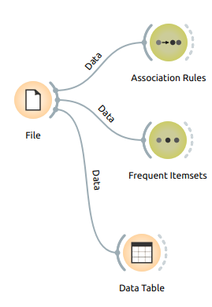
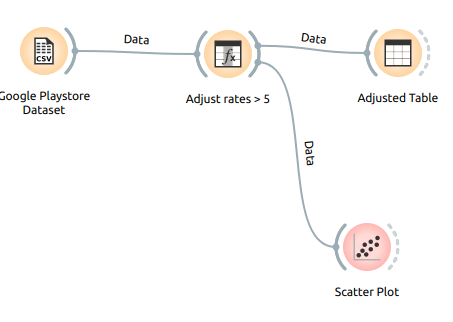
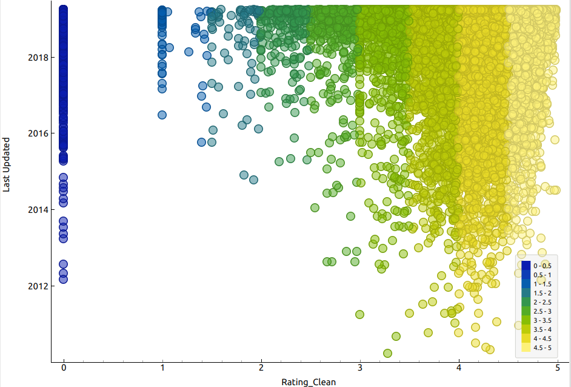
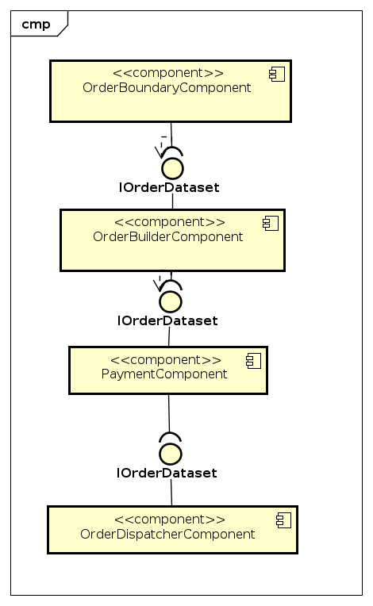
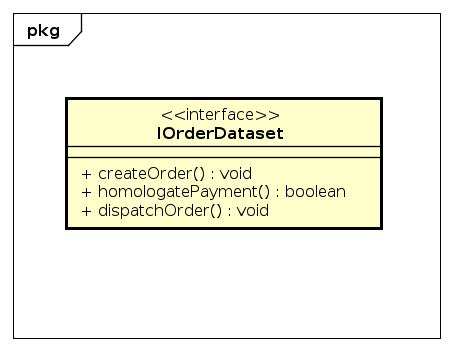

# Lab01
- Paulo Mellin Gimenes
# Projeto Orange / Regras de Associação para Foodmart
## Imagem do Projeto

## Arquivo do Projeto
[orange/foodmart.ows](orange/foodmart.ows)
# Projeto Orange / Análise de Dados do Google PlayStore
## Imagem do Projeto

## Arquivo do Projeto
[orange/google-playstore-preparion.ows](orange/google-playstore-preparation.ows)
## Gráfico de Análise
### Nota do estudante: optei por fazer um scatter plot do atributo rating_clean vs last_update e notei que quanto mais atualizado o aplication melhor a avaliação

# Projeto de Composição de Componentes para Pedido
## Diagrama de componentes

### Arquivo do Projeto
[astah/product_order_components.asta](astah/product_order_components.asta)
## Diagrama de interface

