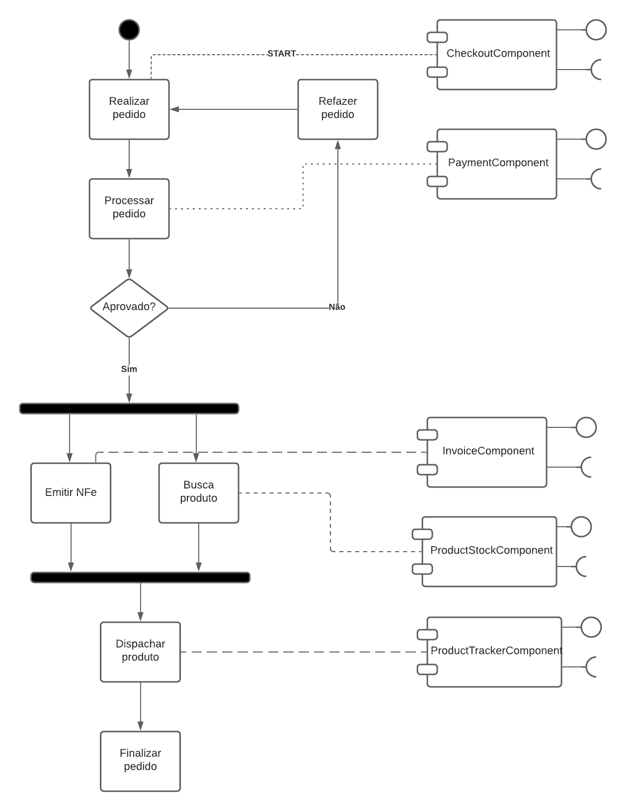
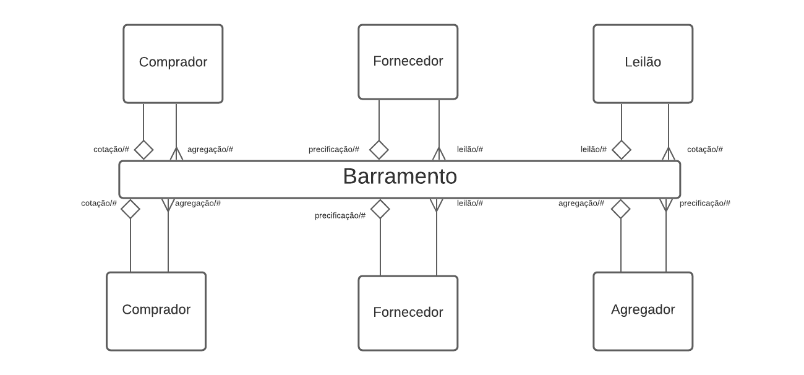
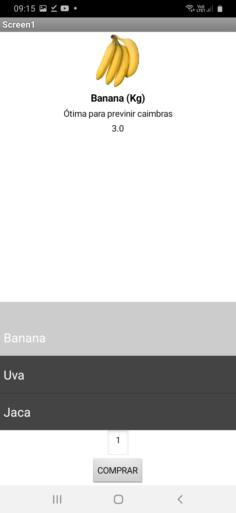
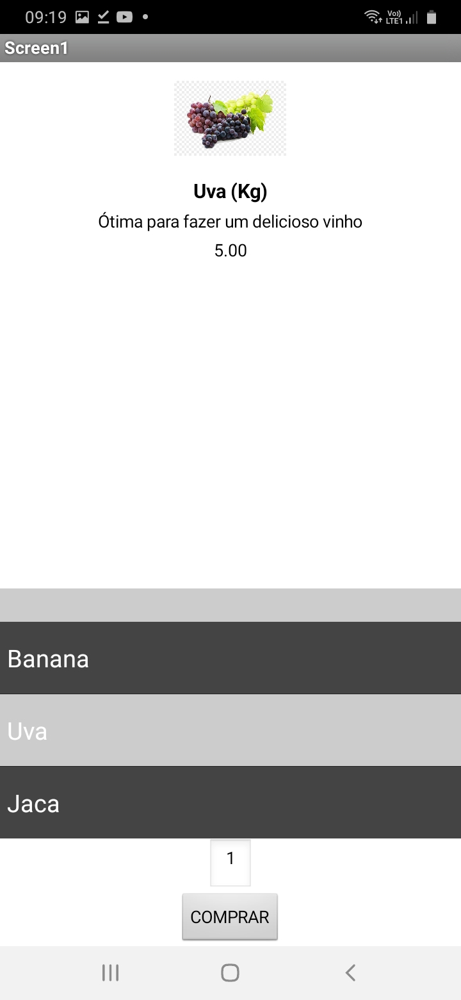
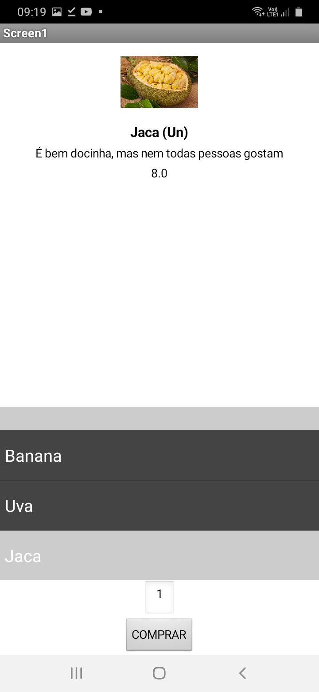
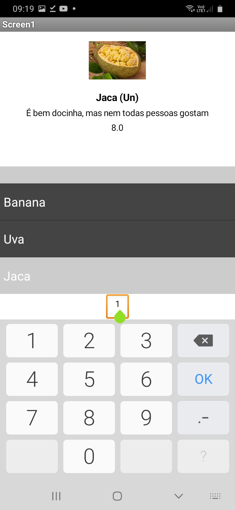
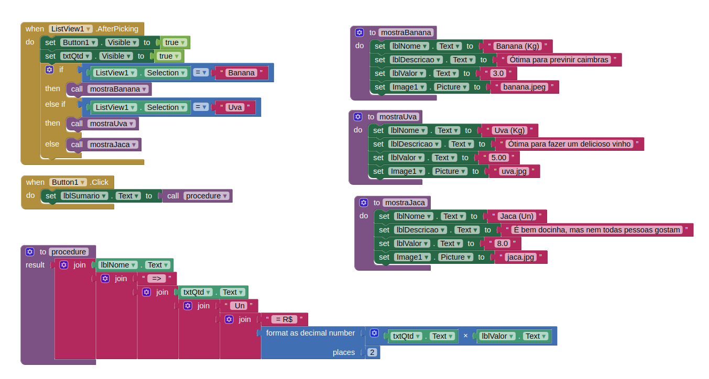

# Lab03 - Model-View-Controller

## Tarefa 1

## Tarefa 2

1. O componente Comprador faz postagem de mensagem utilizando o tópico *cotação/#* (exemplo: cotação/geladeira);
2. O componente Leilão assina o tópico *cotação* e realiza publicação de mensagem utilizando o tópico *leilão*;
3. Os componentes do tipo Fornecedor assinam o tópico *leilão* e fazem publicação de mensagens com o tópico *precificação*;
4. O componente Agregador assina o tópico *precificação* e realiza publicação de mensagem com o tópico *agregado*;
5. Os componentes do tipo Comprador assinam o tópico *agregado* e mostra os melhores preços para os consumidores.

## Tarefa 3

> 
> 
> 
> 
> 
> 

[Link para o arquivo do aplicativo](app/tarefa3.aia)
