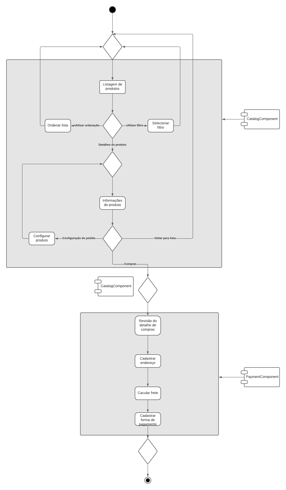
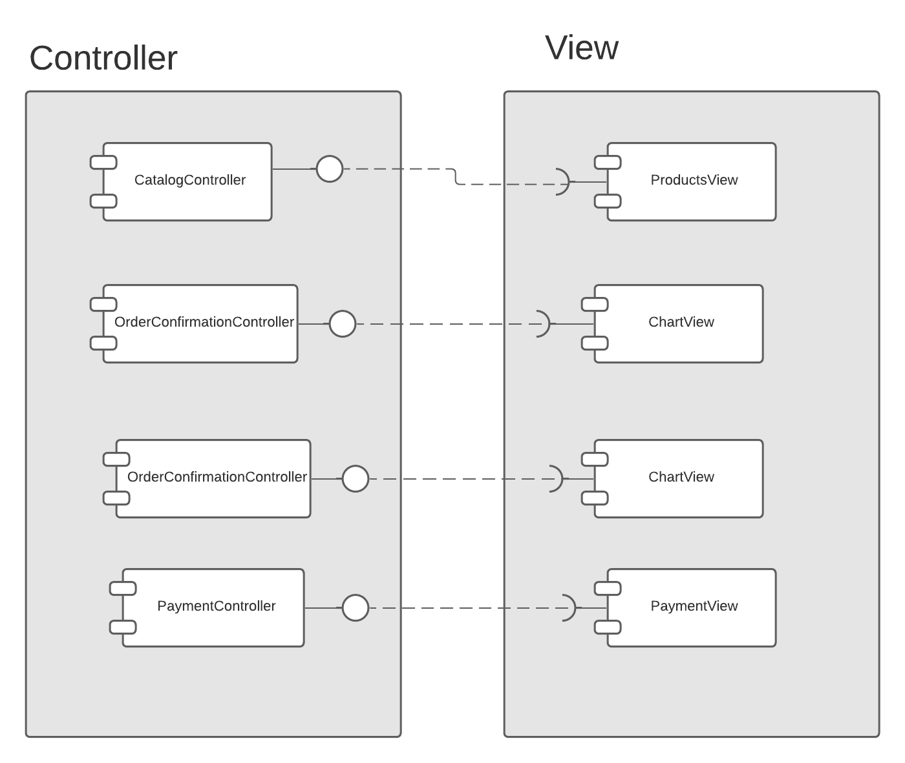
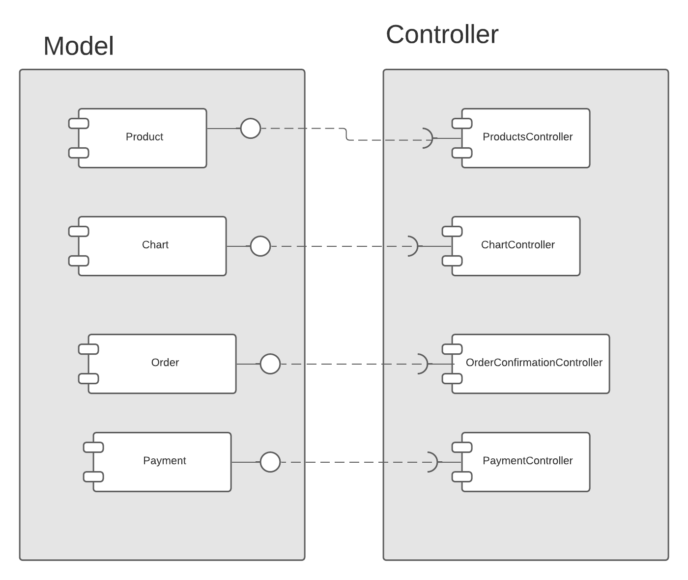

# Modelo para Apresentação do Lab04 - Serviços

## Tarefa 1


## Tarefa 2


## Tarefa 3



## Tarefa 4

### Serviço `discogs`

* **Título do serviço**: `Discogs API`
* **Breve descrição**: 
  > A API do discog retorna informações dos artistas por ID. Neste exemplo foi usado os beatles (ID: 82730). Podemos ver informações sobre os membros, nomes da banda e etc.
* **URL completa da requisição**: `https://api.discogs.com/artists/82730`
* **Cabeçalho HTTP da chamada**:
Usei curl, logo não enviei opções de header
```
curl -I https://api.discogs.com/artists/82730
```
* **Cabeçalho HTTP da resposta**:
~~~http
HTTP/2 200 
date: Sun, 20 Sep 2020 15:57:34 GMT
content-type: application/json
content-length: 6459
vary: Accept-Encoding
vary: Accept-Encoding
x-discogs-ratelimit: 25
x-discogs-ratelimit-remaining: 24
x-discogs-ratelimit-used: 1
access-control-allow-headers: Content-Type, authorization, User-Agent, Private-Auth-Secret, Discogs-UID
access-control-allow-methods: HEAD,OPTIONS,GET,OPTIONS
access-control-expose-headers: Location
x-discogs-media-type: discogs.v2
access-control-allow-origin: *
x-frame-options: SAMEORIGIN
x-xss-protection: 1; mode=block
x-content-type-options: nosniff
cache-control: public, must-revalidate
strict-transport-security: max-age=15724800
~~~
* **Conteúdo da resposta**:
~~~json
{
  "name": "The Beatles",
  "id": 82730,
  "resource_url": "https://api.discogs.com/artists/82730",
  "uri": "https://www.discogs.com/artist/82730-The-Beatles",
  "releases_url": "https://api.discogs.com/artists/82730/releases",
  "images": [
    {
      "type": "primary",
      "uri": "",
      "resource_url": "",
      "uri150": "",
      "width": 600,
      "height": 600
    },
    {
      "type": "secondary",
      "uri": "",
      "resource_url": "",
      "uri150": "",
      "width": 567,
      "height": 562
    },
    {
      "type": "secondary",
      "uri": "",
      "resource_url": "",
      "uri150": "",
      "width": 567,
      "height": 589
    },
    {
      "type": "secondary",
      "uri": "",
      "resource_url": "",
      "uri150": "",
      "width": 567,
      "height": 577
    },
    {
      "type": "secondary",
      "uri": "",
      "resource_url": "",
      "uri150": "",
      "width": 600,
      "height": 450
    },
    {
      "type": "secondary",
      "uri": "",
      "resource_url": "",
      "uri150": "",
      "width": 567,
      "height": 567
    },
    {
      "type": "secondary",
      "uri": "",
      "resource_url": "",
      "uri150": "",
      "width": 567,
      "height": 704
    },
    {
      "type": "secondary",
      "uri": "",
      "resource_url": "",
      "uri150": "",
      "width": 567,
      "height": 657
    },
    {
      "type": "secondary",
      "uri": "",
      "resource_url": "",
      "uri150": "",
      "width": 308,
      "height": 212
    },
    {
      "type": "secondary",
      "uri": "",
      "resource_url": "",
      "uri150": "",
      "width": 600,
      "height": 600
    },
    {
      "type": "secondary",
      "uri": "",
      "resource_url": "",
      "uri150": "",
      "width": 567,
      "height": 652
    },
    {
      "type": "secondary",
      "uri": "",
      "resource_url": "",
      "uri150": "",
      "width": 550,
      "height": 387
    },
    {
      "type": "secondary",
      "uri": "",
      "resource_url": "",
      "uri150": "",
      "width": 567,
      "height": 425
    },
    {
      "type": "secondary",
      "uri": "",
      "resource_url": "",
      "uri150": "",
      "width": 567,
      "height": 605
    },
    {
      "type": "secondary",
      "uri": "",
      "resource_url": "",
      "uri150": "",
      "width": 600,
      "height": 468
    },
    {
      "type": "secondary",
      "uri": "",
      "resource_url": "",
      "uri150": "",
      "width": 600,
      "height": 450
    }
  ],
  "profile": "British rock/pop group, formed in Liverpool, England during the late 1950s. Signed to recording contract with EMI in 1962.\r\n\r\nThe lineup (1962-70) comprised John Lennon (vocals, guitar, harmonica, keyboards), Paul McCartney (vocals, bass, guitar, keyboards, percussion), George Harrison (guitar, vocals, sitar), and Ringo Starr (drums, vocals, percussion). During 1961, Stuart Sutcliffe (bass) and Pete Best (drums) were also members.\r\n\r\nFollowing an initial period as a straightforward Mersey-beat group, later recordings saw them experiment with psychedelia, incorporating innovative production techniques involving tape loops and other effects. Although the group split in 1970, they have continued to release special products. \r\n\r\nInducted into Rock And Roll Hall of Fame in 1988 (Group). By 2015, all four members were inducted also as individual solo artists.",
  "urls": [
    "https://www.thebeatles.com/",
    "https://www.facebook.com/thebeatles/",
    "https://twitter.com/thebeatles",
    "https://www.instagram.com/thebeatles/",
    "https://myspace.com/thebeatles",
    "https://soundcloud.com/thebeatles",
    "https://www.youtube.com/user/thebeatles",
    "https://www.youtube.com/user/TheBeatlesVEVO",
    "https://en.wikipedia.org/wiki/The_Beatles",
    "https://www.britannica.com/topic/the-Beatles",
    "https://www.beatlesagain.com/",
    "https://www.beatlesbible.com/",
    "https://aboutthebeatles.com/",
    "https://www.allmusic.com/artist/the-beatles-mn0000754032",
    "http://www.acclaimedmusic.net/artist/The%20Beatles.htm",
    "http://thebeatles-collection.com/"
  ],
  "namevariations": [
    "\"Битлз\"",
    "Beatles",
    "Beatlez",
    "Bitlsi",
    "De Beatles",
    "De Bietels",
    "Die Beatles",
    "I Beatles",
    "Lennon/McCartney",
    "Les Beatles",
    "Los Beatles",
    "P.D.",
    "Savage Young Beatles",
    "Silver Beatles",
    "Teh Beatles",
    "The Amazing Beatles",
    "The Beatals",
    "The Beatle",
    "The Beatles (Featuring Ringo Starr)",
    "The Beatles = Битлз",
    "The Beatles First",
    "The Beatles!",
    "The Beatles'",
    "The Beattles",
    "The Betles",
    "The Live Beatles",
    "The Original Beatles",
    "The Savage Young Beatles",
    "The Silver Beatles",
    "Thg Beales",
    "Анс. \"Битлз\"",
    "Ансамбль \"Битлз\"",
    "Ансамбль «Битлз»",
    "Биитлз",
    "Битлз",
    "Битлз Вокально-инстр. Ансамбль",
    "Битлс",
    "Битълс",
    "Битьлc",
    "Бітлз",
    "Вок. Инстр. Състав Битълс",
    "Квартет \"Битлс\"",
    "Квартет «Битлс»",
    "ザ・ビートルズ",
    "ザ・ビートルズ・クラブ",
    "ビートルズ",
    "披頭合唱團",
    "披頭四合唱團",
    "비틀즈"
  ],
  "aliases": [
    {
      "id": 356120,
      "name": "The Quarrymen",
      "resource_url": "https://api.discogs.com/artists/356120"
    },
    {
      "id": 380838,
      "name": "The Beat Brothers (2)",
      "resource_url": "https://api.discogs.com/artists/380838"
    },
    {
      "id": 1629736,
      "name": "Johnny And The Moondogs",
      "resource_url": "https://api.discogs.com/artists/1629736"
    },
    {
      "id": 4614752,
      "name": "Los Grillos (7)",
      "resource_url": "https://api.discogs.com/artists/4614752"
    },
    {
      "id": 5923525,
      "name": "The Fab Four",
      "resource_url": "https://api.discogs.com/artists/5923525"
    },
    {
      "id": 5923552,
      "name": "The Threetles",
      "resource_url": "https://api.discogs.com/artists/5923552"
    }
  ],
  "members": [
    {
      "id": 35301,
      "name": "Paul McCartney",
      "resource_url": "https://api.discogs.com/artists/35301",
      "active": true
    },
    {
      "id": 46481,
      "name": "John Lennon",
      "resource_url": "https://api.discogs.com/artists/46481",
      "active": true
    },
    {
      "id": 243955,
      "name": "George Harrison",
      "resource_url": "https://api.discogs.com/artists/243955",
      "active": true
    },
    {
      "id": 298525,
      "name": "Richard Starkey",
      "resource_url": "https://api.discogs.com/artists/298525",
      "active": true
    },
    {
      "id": 337031,
      "name": "Pete Best",
      "resource_url": "https://api.discogs.com/artists/337031",
      "active": false
    },
    {
      "id": 459513,
      "name": "Stuart Sutcliffe",
      "resource_url": "https://api.discogs.com/artists/459513",
      "active": false
    }
  ],
  "data_quality": "Needs Vote"
}
~~~
