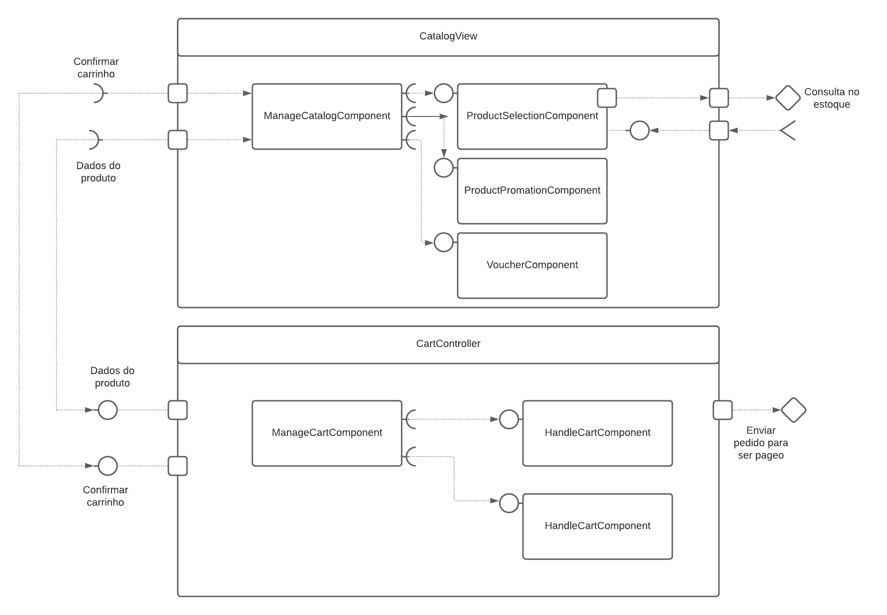

## Tarefa 1



## Tarefa 2
Link para o projeto no Codepen: [React 03 - Componente Barra](https://codepen.io/pmellingimenes-the-animator/pen/PoGWJrM)

Foi feito um pequeno refactor utilizando o loadash para substituir o loop `for` por:
```javascript
_.range(this.props.tamanho).map(() => '=')
```
Ao mesmo tempo foi adicionado a propriedade cor para a barra.

**HTML**
~~~html
<div id="root"></div>
~~~

**JavaScript**
~~~javascript
class Barra extends React.Component {
  render() {
    return (
      <div style={{ color: this.props.cor}}>
        {_.range(this.props.tamanho).map(() => '=')}
      </div>
     )

  }
}


const elemento = <div>
                   <h2>O dinossauro</h2>
                   <Barra cor="green" tamanho="10"/>
                   <h2>pulou na lama.</h2>
                 </div>
ReactDOM.render(elemento,
        document.getElementById("root"));


~~~
